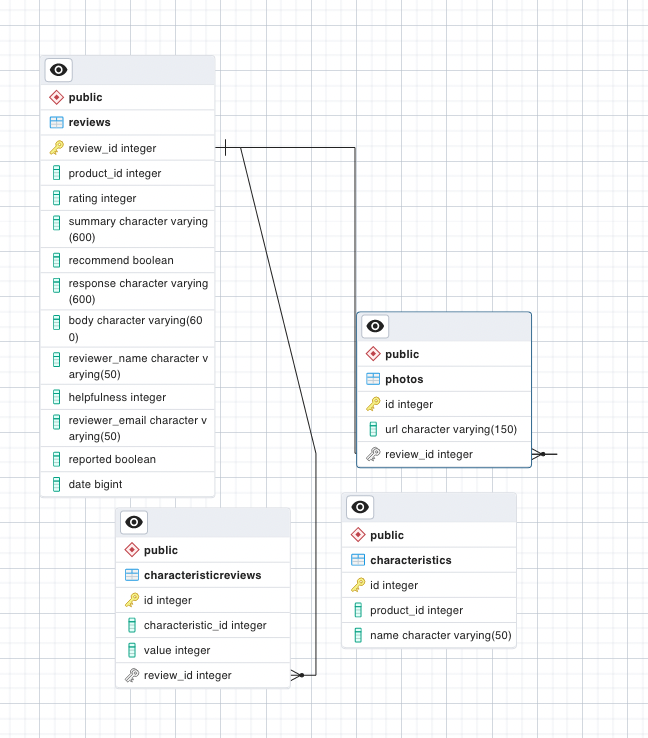

# Overview

This project is premised on a fictional online retalier - Atelier Fashions - which has requested a comprehensive rebuild of the back end of their e-commerce site, inclusive of the server, controllers and database. The project team is also tasked with migrating the existing data from the old system and for delivering the data in a form that fullfills the contract with the front-end requirements. The overall product must be deployed on Amazon EC2 instances with at least two stand-alone servers and a load balancer to reduce the bottlenecks and latency related to high volume of server traffic. Accordingly, the overall system must be load tested prior to delivery to the client, Atelier Fashions.

The front-end of the site is designed as a series of micro-services, each with its own data set and unique data delivery requirements. Therefore, each member of the project team is responsible for architecting, building and deploying the requisite back-end functionality related to one of these micro-services. I worked on the product reviews. 

**<h1 text-decoration='underline'>Database</h1>**

**<h2>1. Selection</h2>** 
The existing data-set was pre-organized into several stand-alone traunches of (at the minimum) 15m+ records in csv files. Furthermore, each record had its own key/id to assist in the look up of associated records (i.e. a single product review may have multiple pictures uploaded by the reviewer). A SQL database was the logical choice for the new database given the data's relational structure.  I selected Postgres in a choice between that and MySQL for its json building capabilities and strongly supported (and free!) PgAdmin interface. 

**<h2>2. Structure </h2>** 
Below is a diagram of the Atelier Reviews database schema:
 The database contains four tables: 
* *Reviews*: This table contains most of the review content, such as their name, the product reviewed, and their written review.
*  *Photos*: The user has the option to upload photos as part of their review. This is a one-to-many relationship (i.e. one review record to many photos). The primary key from the Reviews table is a foriegn key, it is also an indexed relationship from Photos to Reviews.
*  *Characteristics*: On the front-end, the user is invited to review the product on certain pre-set characteristics which are contingent on the product. For example, a pair of shoes may be rated on 'size' and 'width', but sunglasses may be only reviewed on 'style'. The Characteristics table links the product to each of the characteristics on which it may be rated. It is therefore a many-to-many relationship.
*  *Characteristics Reviews*: This table links the reviewer's numeric ratings of all the product's characteristics to the rest of the review. Each row in this table accounts for the reviewer's score of a single characteristic, which is referenced using the charactertic id and connected to the specific review by the review_id.   
